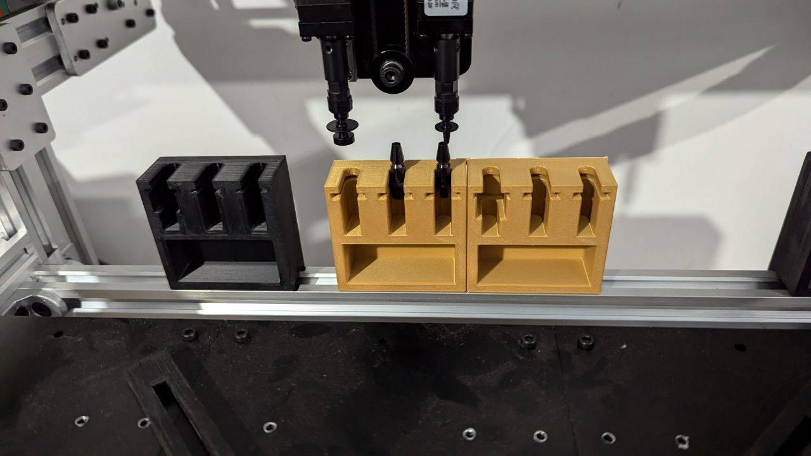
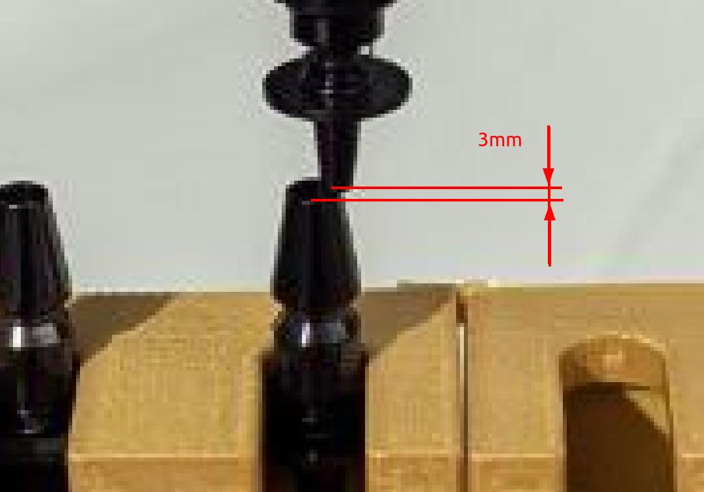

### Modified Nozzle Rack

PNP-V3 rack models and Freecad source files.
There are models with lower height to have posibility move head with nozzles 
over rack with nozzles with a gap of about 1-3 mm

On the photo the gold ones the current lower racks.
Black one is original model and it's have excesive height - loaded nozzles collide 
with nozzle in the rack 

